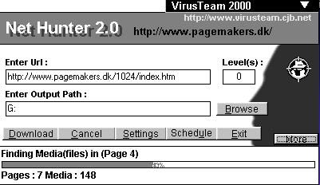



## Net Hunter 2\.0 \*UPDATET\*

### Description

Hey people.

Oki i build the Net Hunter 2.0

This new verison can download all kinda files from a server on the internet.

It can build the dirs on you HD as it is on server.

The new version allso have a shedule. where you can add jobs for it to download.

I am sorry i would have rewrote the codes in VB 5.0 for some of you people, but i really dont have the time to do it. since i am working on BIG project. So this is the last versoin i'll make.

Have fun with it.. and IF you like please tell me and give me a Vote!.

Yours.

CiX
 
### More Info
 

             |
---                |---
**Submitted On**   |2000-12-14 18:08:42
**By**             |[CiX](https://github.com/Planet-Source-Code/PSCIndex/blob/master/ByAuthor/cix.md)
**Level**          |Intermediate
**User Rating**    |4.8 (38 globes from 8 users)
**Compatibility**  |VB 6\.0
**Category**       |[Internet/ HTML](https://github.com/Planet-Source-Code/PSCIndex/blob/master/ByCategory/internet-html__1-34.md)
**World**          |[Visual Basic](https://github.com/Planet-Source-Code/PSCIndex/blob/master/ByWorld/visual-basic.md)
**Archive File**   |[CODE\_UPLOAD1268412142000\.zip](https://github.com/Planet-Source-Code/cix-net-hunter-2-0-updatet__1-13456/archive/master.zip)

